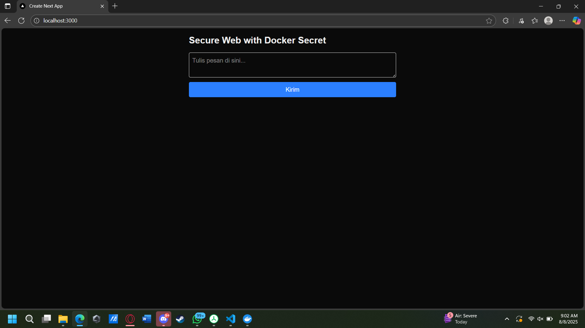

# **Secure Web with Docker Secret**

**Nama:** Muhammad Razan Athaya Dradjat  
**NIM:** 103012300453  

Pada tugas ini saya membuat implementasi Docker Secret menggunakan web dan redis.

## **1. Membuat Web**
Langkah pertama adalah membuat web lengkap dengan *backend*-nya yang terhubung dengan redis

Disini saya menggunakan next.js sebagai *framework*-nya

<pre>
#file route.js

import { NextResponse } from 'next/server';
import redis from '@/lib/redis'; // Impor koneksi redis yang sudah dikonfigurasi

export async function POST(request) {
  try {
    const body = await request.json();
    const { message } = body;

    if (!message || typeof message !== 'string' || message.trim() === '') {
      return NextResponse.json(
        { error: 'Pesan tidak boleh kosong.' },
        { status: 400 }
      );
    }

    // Coba simpan pesan ke dalam list 'messages' di Redis
    await redis.lpush('messages', message);
    console.log(`Pesan "${message}" berhasil disimpan ke Redis.`);

    const replyMessage = `Pesan Anda "${message}" telah berhasil disimpan!`;
    return NextResponse.json({ reply: replyMessage });

  } catch (redisError) {
    console.error('API Error: Gagal menyimpan ke Redis:', redisError.message);
    return NextResponse.json(
      { error: 'Tidak dapat terhubung atau menyimpan ke database Redis. Pastikan Redis berjalan dan konfigurasi benar.' },
      { status: 500 }
    );
  }
}
</pre>

<pre>
file redis.js

import Redis from 'ioredis';
import fs from 'fs'; // Impor modul 'fs' untuk membaca file

let redisPassword = null;

// Cek jika variabel lingkungan REDIS_PASSWORD_FILE ada (saat berjalan di Docker)
if (process.env.REDIS_PASSWORD_FILE) {
  try {
    // Baca isi file password yang path-nya diberikan oleh Docker Secret
    redisPassword = fs.readFileSync(process.env.REDIS_PASSWORD_FILE, 'utf8').trim();
    console.log("Konfigurasi: Menggunakan password dari Docker Secret.");
  } catch (err) {
    console.error("ERROR: Gagal membaca file password dari secret:", err);
  }
} else {
  console.log("Konfigurasi: Menjalankan tanpa password (mode development lokal).");
}

const redis = new Redis({
  host: process.env.REDIS_HOST || '127.0.0.1',
  port: parseInt(process.env.REDIS_PORT) || 6379,
  password: redisPassword, // Gunakan password yang dibaca dari file
});

redis.on('connect', () => {
  console.log('STATUS: Berhasil terhubung ke Redis!');
});

redis.on('error', (err) => {
  console.error('STATUS: Koneksi Redis Gagal:', err.message);
});

export default redis;
</pre>

jangan lupa instalasi redisnya menggunakan

<pre>npm install ioredis</pre>

## **2. Input Password di Docker Secret**
Untuk membuat file ada dua cara bisa menggunakan

<pre>echo "password-redis" | docker secret create redis_password -</pre>

atau buat file password redis dalam bentuk .txt, disini saya membuat dengan nama `redis-password.txt` dengan password yang sama dengan diatas.

Pastikan file `redis_password.txt` sudah ditambahkan ke dalam `.gitignore` agar tidak terkirim ke repositori.

## **3. Buat file Dockerfile dan docker-compose.yml**
Buat seperti dibawah ini untuk mengakomodir Docker Compose dan Docker Swarm/Stack

<pre>
file Dockerfile

FROM node:18-alpine

WORKDIR /app
COPY . .
RUN npm install
RUN npm run build

EXPOSE 3000
CMD ["npm", "start"]
</pre>

<pre>
file docker-compose.yml

services:
  web:
    build: .
    image: mynextapp:latest
    ports:
      - "3000:3000"
    environment:
      REDIS_HOST: redis
      REDIS_PORT: 6379
      REDIS_PASSWORD_FILE: /run/secrets/redis_password
    secrets:
      - redis_password
    deploy:
      replicas: 1
      restart_policy:
        condition: on-failure

  redis:
    image: redis:alpine
    command: sh -c "redis-server --requirepass \"$$(cat /run/secrets/redis_password)\""
    secrets:
      - redis_password
    ports:
      - "6379:6379"
    deploy:
      replicas: 1
      restart_policy:
        condition: on-failure

secrets:
  redis_password:
    #external: true # Ini Untuk Docker Swarm
    #file: ./redis_password.txt #Ini untuk Docker Compose biasa

</pre>

### Metode A: Menjalankan dengan `docker compose`

Jalankan 

<pre>docker compose up --build</pre>
- --build: Membangun image aplikasi dari Dockerfile

ketika sudah berjalan coba masukkan teks melalui web. Ketika sudah coba cek melalui redis dengan cara

<pre>docker exec -it NAMA_KONTAINER_YANG_BENAR redis-cli</pre>

lalu akan keluar seperti ini

<pre>PS D:\Documents\dokumen pribadi\File Telkom\file seleksi mbc lab\2025\week1\my-app> docker exec -it my-app-redis-1 redis-cli   
127.0.0.1:6379> </pre>

masukkan `AUTH password-redis` kemudian lakukan `ping'.
Jika sudah keluar output `PONG` maka berhasil

Selanjutnya ketik `KEYS *` lalu masukkan `LRANGE <ubah sesuai key-nya></ubah> 0 -1`

jika sudah ada berarti sudah masuk

### Metode B: Menjalankan dengan `docker swarm` / `docker stack`

#### Langkah 1: Inisialisasi Docker Swarm
Jika Anda belum pernah mengaktifkan mode Swarm di mesin Anda, jalankan perintah ini satu kali:

<pre>docker swarm init</pre>

Jika sudah aktif, Anda bisa melewati langkah ini.

#### Langkah 2: Deploy Aplikasi sebagai Stack

jangan lupa untuk konfigurasi ulang file docker-compose.yml.

<pre>
secrets:
  redis_password:
    external: true # Ini Untuk Docker Swarm
    file: ./redis_password.txt #Ini untuk Docker Compose biasa
</pre>

untuk yang bukan untuk docker swarm silahkan dibuat *comment*

#### Langkah 3: Deploy Aplikasi sebagai Stack

Gunakan perintah docker stack deploy untuk menjalankan aplikasi Anda.

<pre>
docker stack deploy -c docker-compose.yml <nama stack>
</pre>
- -c menunjuk ke file docker-compose.yml sebagai sumber konfigurasi.

setelah itu bisa dilakukan verifikasi input data seperti sebelumnya

# Jawaban Pertanyaan

### 1. Apa perbedaan ketika aplikasi dijalankan di Compose (docker compose) dan Stack (docker swarm)?

Perbedaan utama antara menjalankan aplikasi dengan Docker Compose dan Docker Stack (Swarm) terletak pada tujuan penggunaan dan kemampuan pengelolaannya.

Docker Compose idealnya digunakan untuk lingkungan pengembangan (development) lokal. Perintah docker compose up akan secara sederhana membangun dan menjalankan semua kontainer yang Anda definisikan. Namun, Compose bekerja di satu mesin saja dan tidak memiliki fitur pengelolaan canggih seperti replikasi atau rolling update.

Docker Stack dirancang untuk lingkungan produksi (production). Dengan perintah docker stack deploy, aplikasi Anda tidak hanya dijalankan sebagai kontainer biasa, tetapi sebagai service yang dikelola oleh Docker Swarm. Ini memberikan kemampuan pengaturan penuh secara otomatis, termasuk menjalankan beberapa replika untuk skalabilitas, melakukan pembaruan tanpa downtime (rolling updates), dan memanfaatkan fitur keamanan tingkat lanjut seperti Docker Secret dengan optimal.

### 2. Apakah cache Redis di Compose dan Stack itu sama?
Tidak, cache Redis yang berjalan di Compose dan Stack sama sekali tidak sama.

Alasannya sederhana: Docker memperlakukan lingkungan Compose dan Stack sebagai dua "dunia" yang benar-benar terpisah. Meskipun Anda menggunakan file docker-compose.yml yang sama, saat dijalankan dengan docker compose up, Docker membuat satu set kontainer, jaringan, dan volume khusus untuk Compose. Lalu, saat Anda menjalankan docker stack deploy, Docker akan membuat satu set baru yang sama sekali berbeda untuk Swarm.

Jadi, meskipun nama volume penyimpan data Redis-nya sama di dalam file konfigurasi, pada praktiknya ada dua volume yang terpisah. Akibatnya, data atau cache yang Anda simpan saat menjalankan aplikasi di mode Compose terisolasi dan tidak akan bisa diakses saat Anda beralih ke mode Stack, begitu pula sebaliknya.

### 3. Jika container Redis dihapus, apakah data cache masih ada?
Ya, datanya masih akan tetap ada, asalkan volume penyimpanannya tidak ikut dihapus.

Begini penjelasannya: Bayangkan kontainer Redis itu seperti mesinnya, sementara volume itu seperti hard disk eksternal tempat semua datanya disimpan.

Jika Anda hanya menghapus mesinnya (kontainernya), hard disk eksternal (volume) yang berisi data cache Anda akan tetap aman. Saat Anda membuat kontainer Redis yang baru, Anda bisa menyambungkan kembali "hard disk" tersebut, dan semua data lama Anda akan kembali bisa diakses.

Namun, data tersebut baru akan benar-benar hilang jika Anda secara sengaja menghapus "hard disk eksternal" itu sendiri, misalnya dengan perintah docker volume rm. Jadi, selama volume-nya masih ada, data Anda aman.

### 4.Apakah docker-compose bisa dijalankan di Docker Swarm?
Ya, bisa, tetapi tidak secara langsung. Anda harus menggunakan file docker-compose.yml sebagai "cetakan" untuk mendeploy aplikasi Anda ke Docker Swarm dengan perintah docker stack deploy.

Penting untuk diingat bahwa tidak semua konfigurasi di docker-compose.yml akan berfungsi di Swarm. Beberapa properti seperti container_name atau depends_on akan diabaikan. Oleh karena itu, file docker-compose.yml Anda harus ditulis dalam format versi 3 atau lebih tinggi dan disesuaikan agar kompatibel dengan Swarm.

Singkatnya, docker compose digunakan untuk menjalankan aplikasi di satu mesin, sementara docker stack digunakan untuk menjalankan aplikasi yang sama berdasarkan file docker-compose.yml di lingkungan Swarm.